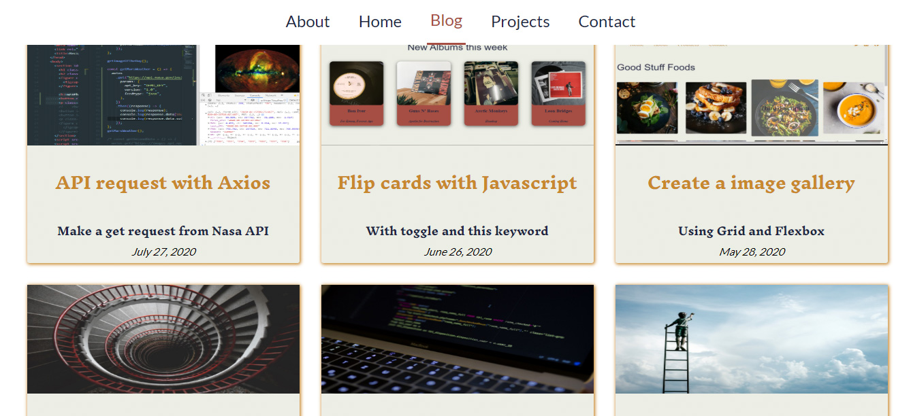
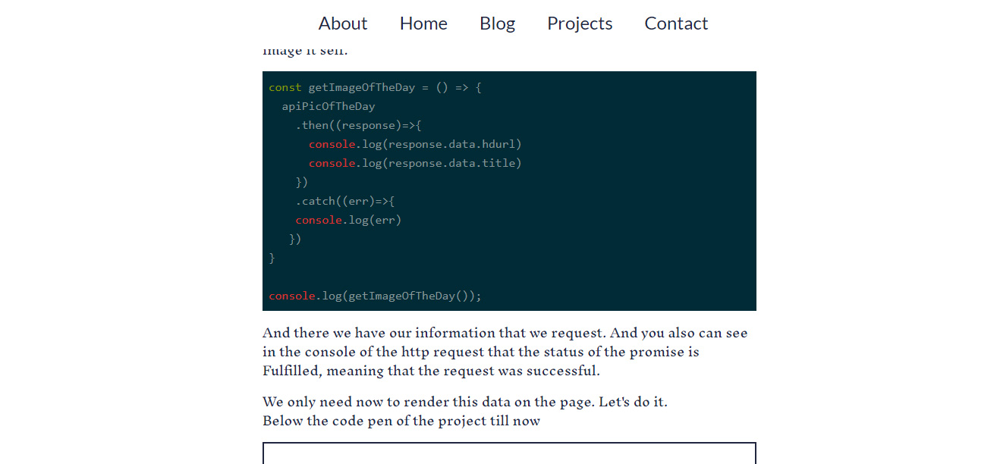

<h1 align="center"> 🔥Recipe App🔥</h1>

<h2 align="center">Recipe app made with vanilla Javascript </h2>

### Index

* [Name](#Name) 👈
* [Links](#Links) 🔗
* [Description](#Description) 📖
* [Languages and Frameworks](####Languages-and-Frameworks) ⚙️
* [Screenshots](#Screenshots) 📱
* [Instalation](#Instalation) 🧩
* [Support](#Support) 🆘
* [Roadmap](#Roadmap) 🗺️
* [Authors and acknowledgment](####Authors-and-acknowledgment) ✍️
* [Project Status](#Project-Status) 📜

# Name

Recipe App

# Links

[Website](https://frosty-gates-971964.netlify.app/)

[Presentation](https://www.ricardomoreira.io/projects/2020-06-02-recipe-app)
___

# Description

The app is based on a API where one can access a recipe, add it to favorite recipes, add ingredients to shopping list and change the quantities and servings for each ingredient.
It's a full tutorial from the [Javascript course](https://www.udemy.com/course/the-complete-javascript-course/).With this tutorial I also start learning about using webpack and babel.
Bu doing this tutorial I learn:

* Webpack
* Babel
* Methods in Arrays
* Async and await
* Different algorithms

___

# Languages, Frameworks and others

* **Javascript** - Language
* **Babel** - Compiler
* **Webpack** - Bundler
* **Fractional** - Arithmetic library

____

# Screenshots

Home Page         |  Blog Page
:-------------------------:|:-------------------------:
  |  

____

# Instalation

___

# Support

Have any question or find something that doesn't look good? Let's talk 😊

[Here](https://github.com/mugas)

[And Here](https://www.ricardomoreira.io/about)

____

# Roadmap

This is a full tutorial. In the future will be integrated and partly used in a different project about food

____

# Authors-and-acknowledgment

* [Tutorial](https://www.udemy.com/course/the-complete-javascript-course/)

____

# Project-Status  

Done

____
